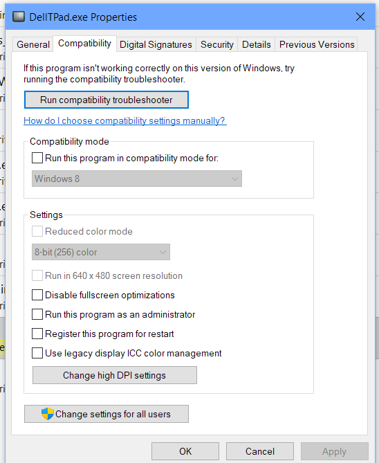
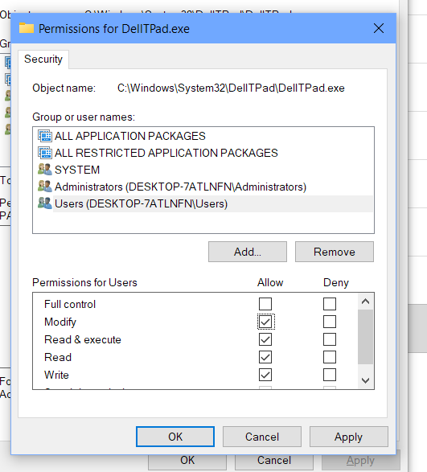

# Currently I have Intel HID Filter and the mentioned Driver Software Installed. Not the Windows Store App obv

^running

no touch scroll / middle nipple + latency  nipple to  touchpad

killing all priocess

Killed last one and nothing happened. Redundant service or lanucher?

​	appmsgforward and aphost no difference

same status as above screencap

aphid monitor service - still same status. This is fucking weird

alpspineHID service (local)

C:\Windows\System32\DriverStore\FileRepository\aphidfiltrd.inf_amd64_2cc79a04b479bc77

(backup of alpspine stuff)

*   Edited permissions for me -  may fix settings saving
*   Rebooting now.
    *   Disabled touchpad in bios -- no effect lolDell
    *   Try to reinstall shitty store app and launch as admin - config - reboot again
    *   Nipple scroll button jumps again

*   Changed touchpad settings as admin and user - didn't work

​	killing services

​	blahblah for windows - killed pointstick sensitivity ah fuck that's the one where I knew it

​	scroll dead ofc

killed apmsgforward and same effect - point stick slow still, middle button

restarting apmonitor service killed touchpad

Perfect! 

​	Configure in DellTpad.exe

​	run ApClose.exe

​	run Apoint.exe

​	config is saved (not sure if DellTpad needs to be elevated, or if that r/w permission thing did anything.)

Rebooting

Yuppp Persistent now. Noice
